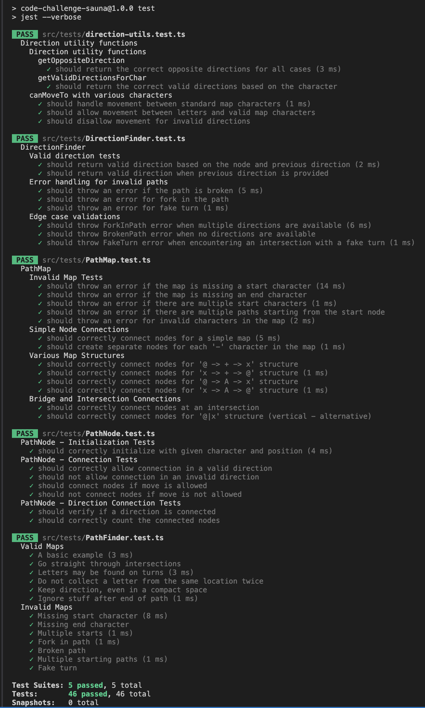

# Software Sauna Code Challenge

## Overview

This is my solution for the Software Sauna Code Challenge. The task involves traversing a 2D grid map, collecting letters along the way, and handling various path scenarios such as intersections, forks, and broken paths. For detailed task specifications, valid and invalid map examples, and expected outputs, please refer to the [original task description](https://github.com/softwaresauna/code-challenge).

## Solution Approach

### How It Works:

The solution revolves around treating each character on the map as a node connected to neighboring nodes (`up`, `down`, `left`, `right`). The traversal starts at the node marked as the starting point (`@`) and continues along valid path characters (`-`, `|`, `+`, `A-Z`) until it either reaches the end node (`x`) or encounters an error.

Each move is validated to ensure the path follows the allowed connections. The program checks each node’s neighboring connections to determine if it can proceed in any of the four directions. Only valid moves between connected nodes are allowed. If the path encounters letters (`A-Z`), they are collected as part of the result.

### Basic Example:

```
@---A---+
        |
x-B-+   C
    |   |
    +---+
```

**Expected result:**

- **Letters:** `ACB`
- **Path as characters:** `@---A---+|C|+---+|+-B-x`

### Input

The input is a 2D grid representing a map made up of specific characters:

- `@`: The start of the path
- `x`: The end of the path
- Path Characters: `-`, `|`, `+` for valid directions and letters `A-Z`, which are also part of the path

The program processes this grid, starting from `@` and moving through the nodes, collecting letters and navigating valid paths.

### Process:

1. **Start from the Start Node (@):**

   - The program begins at `@`, checking the surrounding nodes for valid movement paths, ensuring only valid connections are followed

2. **Traverse Through Nodes:**

   - The program processes each node one at a time:
     - If the node contains a letter, it’s collected and added to the output
     - The traversal continues, moving node by node through valid paths based on neighboring connections

3. **Error Handling:**

   - The program checks for errors during traversal:
     - Missing or multiple `@` or `x`
     - Forks in the path where more than one direction is possible
     - Broken paths or invalid characters
   - If any error is detected, traversal stops and an error message is returned

4. **End at the End Node (x):**
   - The traversal ends at `x`, generating two outputs: collected letters and travelled path

### Output:

- **Valid Path:** If the path is valid, the output will be:
  - **Collected Letters:** A string of letters collected during the traversal
  - **Path:** A string representation of the path taken, showing all the characters visited
- **Error:** If an error is encountered, the output will be an error message explaining what went wrong

## How to Run

### Installation and Running the Program

1. **Install Dependencies:**
   Ensure you have Node.js installed. Then, install the required dependencies:

   ```sh
   npm install
   ```

2. **Run the Program:**
   Execute the main script:
   ```sh
   npm run start
   ```

### Running Tests

1.  **Run Tests:**
    Execute the tests using npm:

        ```sh
        npm run test
        ```

**Note:** The tests from the original task can be found in `src/assets/saunsa.maps.ts`.

### Test Results


